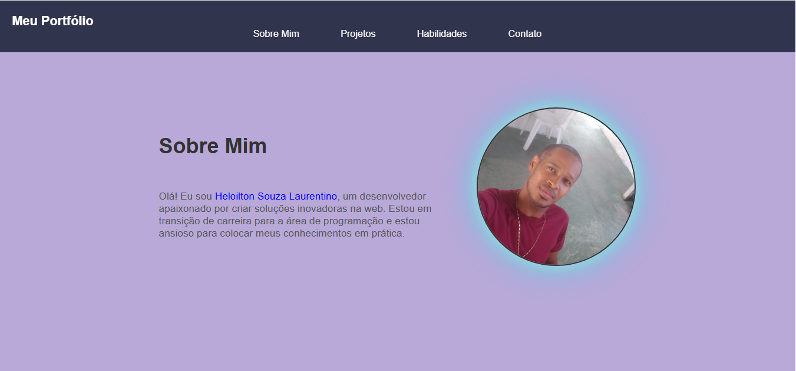

# Página Pessoal "Sobre Mim"

Este é um projeto simples de página pessoal desenvolvido com **HTML5**,**CSS3** e **JAVASCRIPT**, como parte do meu portfólio.

## 💡 Objetivo

Criar uma página responsiva e estilizada para apresentar um pouco sobre mim, minhas habilidades e formas de contato.

## 📸 Preview



## 🛠️ Tecnologias Utilizadas

- HTML5
- CSS3
- JAVASCRIPT

## 🔧 Funcionalidades

- Layout responsivo
- Apresentação pessoal com foto
- Lista de habilidades
- Link para redes sociais ou e-mail

## 📂 Estrutura de Arquivos

sobre-mim/
├── index.html
├── style.css
└── imag/
└── sua-foto.jpg

## 📬 Contato

E-mail: heloiltonsl@gmail.com

LinkedIn: www.linkedin.com/in/heloilton-souza-laurentino-b0464b34a


## 🚀 Como usar

1. Clone o repositório:
   ```bash
   git clone https://github.com/heloysouza/Portifolio.git